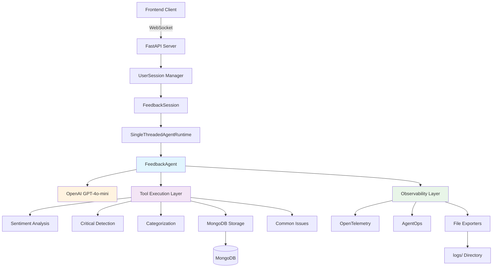

```mermaid
graph TB
    Client[Frontend Client] -->|WebSocket| FastAPI[FastAPI Server]
    FastAPI --> UserSession[UserSession Manager]
    UserSession --> FeedbackSession[FeedbackSession]
    FeedbackSession --> Runtime[SingleThreadedAgentRuntime]
    Runtime --> FeedbackAgent[FeedbackAgent]

    FeedbackAgent --> OpenAI[OpenAI GPT-4o-mini]
    FeedbackAgent --> Tools[Tool Execution Layer]

    Tools --> Sentiment[Sentiment Analysis]
    Tools --> Critical[Critical Detection]
    Tools --> Category[Categorization]
    Tools --> Database[MongoDB Storage]
    Tools --> Analytics[Common Issues]

    FeedbackAgent --> Tracing[Observability Layer]
    Tracing --> OpenTelemetry[OpenTelemetry]
    Tracing --> AgentOps[AgentOps]
    Tracing --> FileExport[File Exporters]

    Database --> MongoDB[(MongoDB)]
    FileExport --> Logs[logs/ Directory]

    style FeedbackAgent fill:#e1f5fe
    style OpenAI fill:#fff3e0
    style Tools fill:#f3e5f5
    style Tracing fill:#e8f5e8
```
